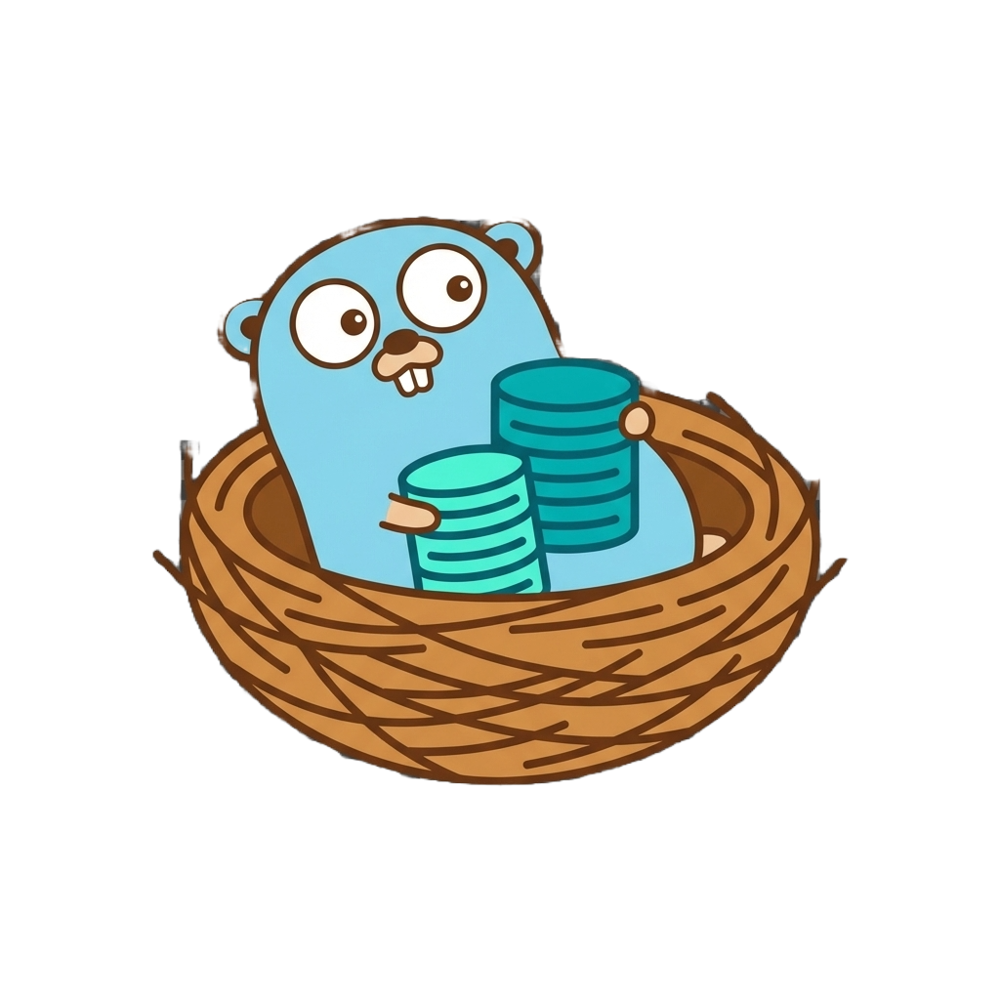

<p align="center">
  
</p>

# DBnest

A self-hosted database management platform. Spin up PostgreSQL, MySQL, MariaDB, or Redis instances in seconds.


## Overview
DBnest is a lightweight, self-hosted database management platform that allows developers and teams to quickly provision, manage, and monitor multiple database instances through a unified web interface. It uses containerization technologies like Docker to isolate each database instance, making it easy to create, delete, and manage databases without complex setups.

## Quick Start

### Docker (Recommended)

```bash
docker run -d \
  -p 8080:8080 \
  -v /var/run/docker.sock:/var/run/docker.sock \
  -v dbnest-data:/data \
  cy01/dbnest:latest
```

Open `http://localhost:8080`

### Binary

```bash
./dbnest --port 8080 --data ./data --runtime docker
```

## Features

- **PostgreSQL** (v12-16)
- **MySQL** (v5.7, 8.0, 8.4)
- **MariaDB** (v10.5-11)
- **Redis** (v6, 7)
- Real-time metrics & charts
- Network Topology Visualization
- Backup & restore
- Built-in authentication
- Docker, Podman, containerd support

## CLI Options

```
--port PORT       HTTP port (default: 8080)
--data PATH       Data directory (default: ./data)
--socket PATH     Container socket path
--runtime NAME    Runtime: docker, podman, containerd (default: docker)
--debug           Enable debug logging
```

## Docker Compose

```yaml
# docker/docker-compose.yml
services:
  dbnest:
    image: ghcr.io/sirrobot01/dbnest:latest
    ports:
      - "8080:8080"
    volumes:
      - /var/run/docker.sock:/var/run/docker.sock
      - dbnest-data:/data

volumes:
  dbnest-data:
```

## Development

```bash
# Backend
go run ./cmd/dbnest

# Frontend (separate terminal)
cd frontend && npm install && npm run dev

# Or use Taskfile
task run
```

## Requirements

- Docker/Podman/containerd

## License
MIT
